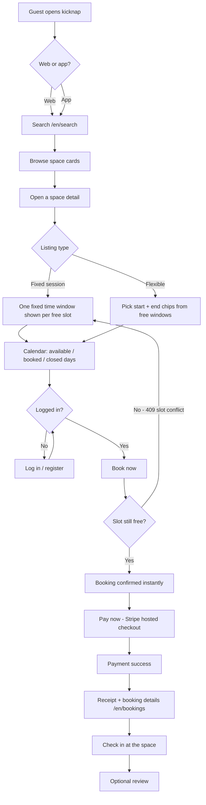
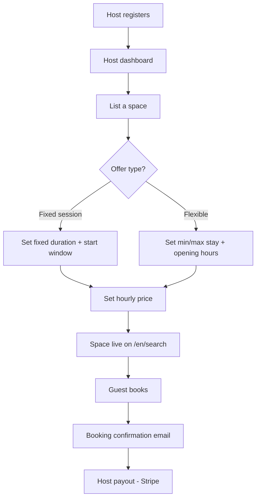
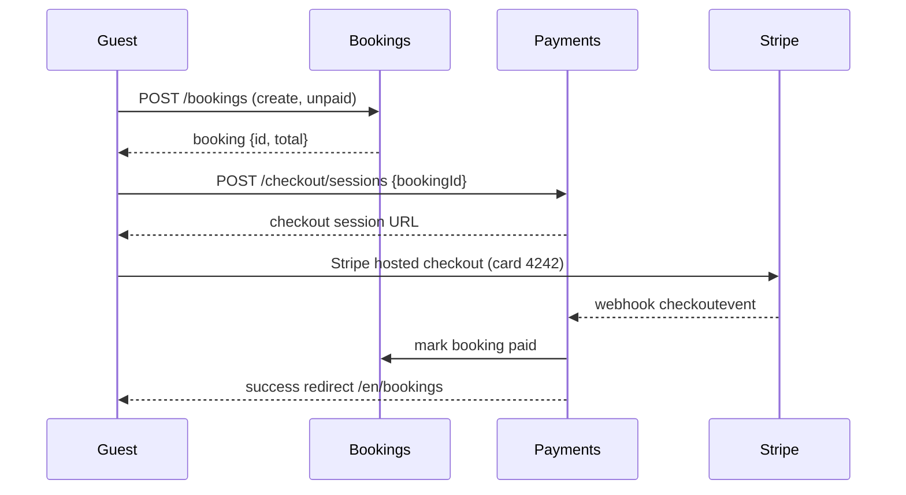

# kicknap — Guest & Host Journey Map

Two-sided flow for the live product (web + iOS/Android app), mapped to the services each step calls. Pricing model: single embedded 16% marketplace fee — the host sets the price they receive (`hourlyPriceCents`), the guest pays one all-in price of `base ÷ 0.84` (fees & taxes included in the displayed total).

## Guest journey

Step → API mapping (guest):

| Step | Service call |
| --- | --- |
| Search / browse | `GET /api/v1/spaces` (listings) |
| Space detail | `GET /api/v1/spaces/:id` (listings) |
| Calendar state | `GET /api/v1/spaces/:id/hours` (availability) + `GET /api/v1/bookings?spaceId=&from=&to` (bookings) — proxied from web as `/api/spaces/[id]/hours` and `/api/spaces/[id]/bookings` |
| Booking creation | `POST /api/v1/bookings` (bookings) — server re-checks slot; returns `409 slot_conflict` if taken |
| Auth | identity (register / login / session cookie) |
| Payment | `POST /api/v1/checkout/sessions` (payments) → Stripe hosted checkout → webhook |
| Bookings list | `GET /api/v1/bookings?guestId=` (bookings) |

## Host journey

Step → API mapping (host):

| Step | Service call |
| --- | --- |
| Register / login | identity |
| List space | `POST /api/v1/spaces` (listing) + rules via availability |
| Availability | `PUT /availability` rules (availability) |
| Pricing | `hourlyPriceCents` on the space + fee model in `computeFees` (payments) |
| Bookings | view in host dashboard via `GET /api/v1/bookings?hostId=` |
| Payout | Stripe host payout (test mode until live keys configured) |

## Payment flow

## Notes / current limits

- Availability is computed from opening-hour rules only; the whole free window + min/max logic lives in `availability` (POST conflict re-check is the source of truth).
- Booking emails are silent until `EMAIL_SMTP_*` + `EMAIL_FROM` are set; Stripe is test mode until live keys configured.
- Demo spaces: 14 = fixed 3h session 13:00–16:00 (Mon–Fri), 22 = fixed 4h 09:00–13:00 (has a booking → shows strikethrough), 13 = flexible 1–8h.